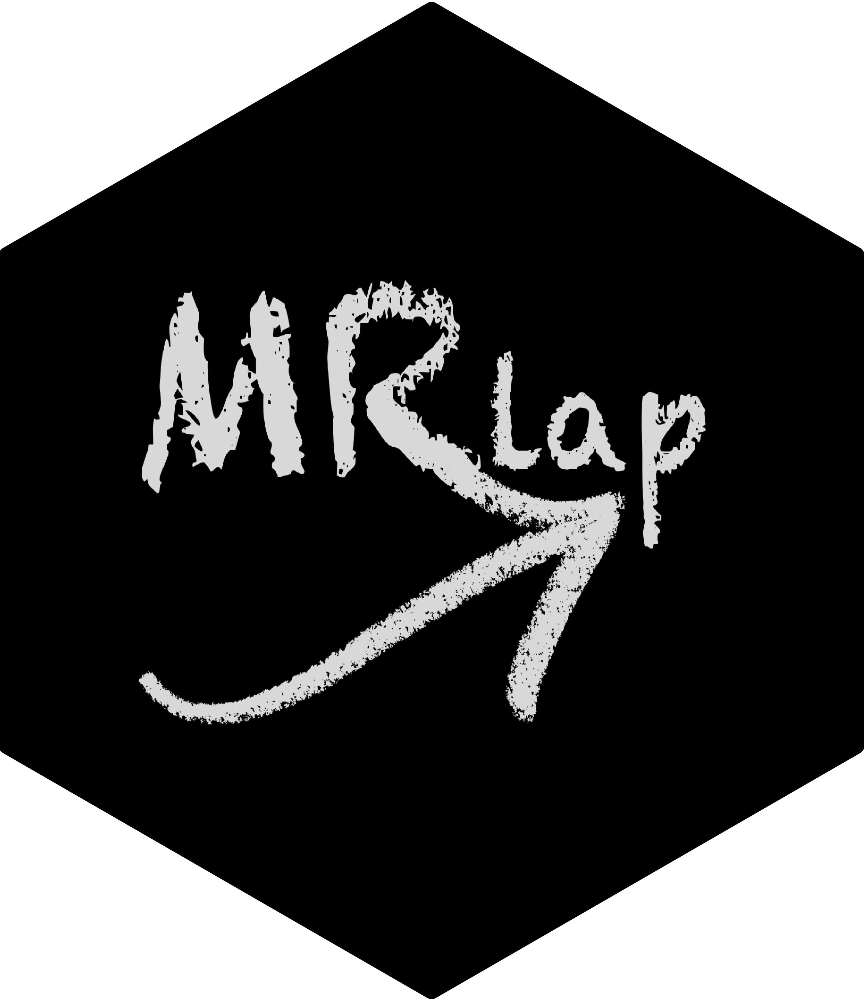

<!-- README.md is generated from README.Rmd. Please edit that file -->

```{r setup, include=FALSE}
knitr::opts_chunk$set(echo = TRUE,
                      fig.path = "doc/Figures/README-",
                      out.width = "100%")
# for tibbles...
options(pillar.neg=F, # do no print neg number in red
        pillar.subtle=F, # turn off highlighting of significant digits
        tibble.width = 170) # default=95, increase it to make it readable
A = readRDS("inst/Data/A.RDS")
B = readRDS("inst/Data/B.RDS")
# # automatically updates manual
devtools::build_manual()
system("mv /Users/nmounier/Documents/SGG/Projects/MRlap_0.0.2.0.pdf /Users/nmounier/Documents/SGG/Projects/MRlap/doc/MRlap-manual.pdf")
#remove.packages("MRlap")
library(MRlap)
```

# MRlap   
<!--- 
# https://github.com/GuangchuangYu/hexSticker
library(hexSticker)
imgurl <- "inst/Figures/MRlap2.png"
sticker(imgurl, 
        package="", p_size=8, p_color="black",
        h_fill="black", h_color="black",
        s_x=0.95, s_y=0.90, s_width=0.95, # MRlap2
        # s_x=0.95, s_y=1.05, s_width=0.95, # MRlap
        filename="inst/Figures/logo.png", dpi=2000) --->
        
<!--- :arrow_right: ESHG/EMGM?? poster is available [here]().  --->    

:information\_source: `MRlap` is still under active development.    
:information\_source: `MRlap` has been updated to version 0.0.2. Note that some features of this version (including the use of case-control data) are still being tested and that in previous versions the exclusion of IVs more strong associated with the outcome than with the exposure was not correcltly performed.           
Check the [NEWS](NEWS.md) to learn more about what has been modified\!

## Overview
[//]:*******

`MRlap` is an R-package to perform two-sample Mendelian Randomisation (MR) analyses using (potentially) overlapping samples, relying only on GWAS summary statistics. MR estimates can be subject to different types of biases due to the overlap between the exposure and outcome samples, the use of weak instruments and winner’s curse. Our approach simultaneously accounts and corrects for all these biases, using cross-trait LD-score regression (LDSC) to approximate the overlap. Estimating the corrected effect using our approach can be performed as a sensitivity analysis: if the corrected effect do not significantly differ from the observed effect, then IVW-MR estimate can be safely used. However, when there is a significant difference, corrected effects should be preferred as they should be less biased, independently of the sample overlap.   
Note that we are working with standardised effects. This means that the causal effect estimates are in units of Standard Deviation (SD). The causal effect estimates correspond to the SD change in the outcome for one SD increase in the exposure.    
It is possible to use case-control GWASs, but it is important to note that our method assumes that sample overlap should be independend of case-control status. Morever, the analysis needs to be performed on the observed scale. This means that GWAS results (from a linear model using case-control status or from a logisitic regression) should be provided alongside the total (number of cases + number of controls) sample size. In such cases, the heritability estimates reported in the results will be different to the ones that are usually estimated (on the liability scale), this is normal. The causal effect estimates correspond to the SD changes / increases on the observed scale.    
This package builds up on the [`GenomicSEM`](https://github.com/GenomicSEM/GenomicSEM/) R-package to perform cross-trait LDSC and the [`TwoSampleMR`](https://github.com/MRCIEU/TwoSampleMR/) R-package for inverse-variance weighted (IVW-)MR analysis (and instruments pruning). 


There is only one function available:  

-   **`MRlap()`**  
main function that performs LDSC, IVW-MR analysis and provides a corrected causal effect estimate.

More details about its usage can be found in the [manual](doc/MRlap-manual.pdf).      

## Installation
[//]:*******

You can install the current version of `MRlap` with:    
```{r install-package, echo=TRUE, eval=F, message=FALSE, results='hide'}
# Directly install the package from github
# install.packages("remotes")
remotes::install_github("n-mounier/MRlap", )
library(MRlap)
```
<!--- Note: using remotes instead of devtools leads to re-build the package
and apparently, it may be a problem with R 3.4 and macOS, 
see https://stackoverflow.com/questions/43595457/alternate-compiler-for-installing-r-packages-clang-error-unsupported-option/43943631#43943631 --->

## Usage
[//]:*******

To run the analysis with `MRlap` different inputs are needed:


#### 1. The exposure and outcome GWAS summary statistics (`exposure` & `outcome`):
Can be a regular (space/tab/comma-separated) file or a gzipped file (.gz) or a `data.frame`. Must contain the following columns, which can have alternative names (not case sensitive):    
SNP-identifier:  `rs` or `rsid`, `snp`, `snpid`, `rnpid`      
Alternate (effect) allele:  `a1` or `alt`, `alts`     
Reference allele: `a2`, `a0`, `ref`     
Z-statistics: `Z`, `zscore`   
Sample size: `N`, `Neff`    

If the Z-statistics is not present, it will be automatically calculated from effect size and standard error, in which case the following columns should be provided:     
Effect-size: `b`, `beta`, `beta1` , `or`   
Standard error:  `se`, `std`    

*If (at least) one of the datasets is coming from a case-control GWAS:*    
... the Sample size column should correspond to the total sample size (not the effective sample size!!).  


#### 2. The input files for LDSC (`ld` & `hm3`):
These are needed by the [`GenomicSEM`](https://github.com/GenomicSEM/GenomicSEM/) R-package.   

- ld:   

> Expects LD scores formated as required by the original LD score regression software. Weights for the european population can be obtained by downloading the eur_w_ld_chr folder in the link below (Note that these are the same weights provided by the original developers of LDSC): https://utexas.box.com/s/vkd36n197m8klbaio3yzoxsee6sxo11v    

- hm3:   

> This file can be obtained from https://utexas.box.com/s/vkd36n197m8klbaio3yzoxsee6sxo11v.


### Analysis
[//]:-------------------------------

Before running the examples, please make sure to have downloaded the input files for LDSC. You may also need to modify the `ld` & `hm3` parameters to indicate the correct paths.    

- **Example A**

```{r exampleA, eval=F}
# Using ~100K samples for BMI/SBP, with 0% of sample overlap
# (only weak instrument bias and winner's curse)
# Note that here the overlap is known (since we generated the data) but the MRlap
# function works even the overlap is unkown (overlap is *not* a parameter of the function) 
# as it uses cross-trait LDSC to approximate it
# (1,150,000 SNPs - stored in gzipped files)
BMI <- system.file("data/", "BMI_Data.tsv.gz", package="MRlap")
SBP <- system.file("data/", "SBP_Data.tsv.gz", package="MRlap")

# MR instruments will be selected using default parameter (5e-8) and distance-pruned (500Kb),
# No file will be saved.
A = MRlap(exposure = BMI,
          exposure_name = "BMI_100Ksample",
          outcome = SBP,
          outcome_name = "SBP_100Ksample",
          ld = "~/eur_w_ld_chr",
          hm3 = "~/w_hm3.noMHC.snplist")

``` 

<details>

  <summary>Show log</summary>
  
    ```{r logAdisplay,echo=FALSE, eval=TRUE}
    cat("<<< Preparation of analysis >>> \n",
        "> Checking parameters \n",
        "The p-value threshold used for selecting MR instruments is: 5e-08 \n",
        "The distance used for pruning MR instruments is:  500 Kb  \n",
        "> Processing exposure (BMI_100Ksample) summary statistics...  \n",
        "# Preparation of the data...  \n",
        "The data.frame used as input is: \"BMI_Data.tsv.gz\".   \n",
        "   SNPID column, ok - CHR column, ok - POS column, ok - ALT column, ok - REF column, ok - Z column, ok - N column, ok  \n",
        "> Processing outcome (SBP_100Ksample) summary statistics...  \n",
        "# Preparation of the data...  \n",
        "The data.frame used as input is: \"SBP_Data.tsv.gz\".   \n",
        "   SNPID column, ok - CHR column, ok - POS column, ok - ALT column, ok - REF column, ok - Z column, ok - N column, ok  \n",
        "<><><><><><><><><><><><><><><><><><><><><><><><><><><><><><><><><><><><><><><><><><><><> \n", 
        "<<< Performing cross-trait LDSC >>>   \n",
        "> Munging exposure data...  \n",
        "> Munging outcome data...  \n",
        "> Running cross-trait LDSC...  \n",
        "  Please consider saving the log files and checking them to ensure that all columns were interpreted correctly and no warnings were issued for any of the summary statistics files \n",
        "> Cleaning temporary files...  \n",
        "<><><><><><><><><><><><><><><><><><><><><><><><><><><><><><><><><><><><><><><><><><><><> \n", 
        "<<< Running IVW-MR >>>   \n",
        "> Identifying IVs...  \n",
        "    668 IVs with p < 5e-08  \n",
        "    0 IVs excluded - more strongly associated with the outcome than with the exposure, p < 1e-03  \n",
        "   Pruning : distance :  500 Kb  \n",
        "    39 IVs left after pruning  \n",
        "> Performing MR  \n",
        "    IVW-MR observed effect: 0.0856 ( 0.0398 ) \n",
        "<><><><><><><><><><><><><><><><><><><><><><><><><><><><><><><><><><><><><><><><><><><><> \n", 
        "<<< Estimating corrected effect >>>   \n",
        "> Estimating genetic architecture parameters...  \n",
        "> Estimating corrected effect...  \n",
        "    corrected effect: 0.115 ( 0.0536 ) \n",
        "    covariance between observed and corrected effect: 0.00215   \n",
        "          10000 simulations were used to estimate the variance and the covariance.\n",
        "> Testing difference between observed and corrected effect...  \n",
        "Runtime of the analysis:  3  minute(s) and  11  second(s). \n")
    ```

    
</details>   
 

- **Example B**

```{r exampleB, eval=F}
# Using simulated exposure/outcome data 
# standard settings scenario, with 100% of sample overlap
# Note that here the overlap is known (since we generated the data) but the MRlap
# function works even the overlap is unkown (overlap is *not* a parameter of the function) 
# as it uses cross-trait LDSC to approximate it
# (~750,000 SNPs - stored as data.frames)

# MR instruments will be selected using a more stringent threshold (5e-10) and LD-pruned (500Kb - r2=0.05),
# No file will be saved.
B = MRlap(exposure = SmallExposure_Data,
          exposure_name = "simulated_exposure",
          outcome = SmallOutcome_Data,
          outcome_name = "simulated_outcome",
          ld = "~/eur_w_ld_chr",
          hm3 = "~/w_hm3.noMHC.snplist",
          MR_threshold = 5e-10,
          MR_pruning_LD = 0.05)
``` 


<details>

  <summary>Show log</summary>
  
    ```{r logBdisplay,echo=FALSE, eval=TRUE}
    cat("<<< Preparation of analysis >>> \n",
        "> Checking parameters \n",
        "The p-value threshold used for selecting MR instruments is: 5e-10 \n",
        "The distance used for pruning MR instruments is:  500 Kb  \n",
        "The LD threshold used for pruning MR instruments is: 0.05 \n",
        "> Processing exposure (simulated_exposure) summary statistics...  \n",
        "# Preparation of the data...  \n",
        "The data.frame used as input is: \"SmallExposure_Data\".   \n",
        "   SNPID column, ok - CHR column, ok - POS column, ok - ALT column, ok - REF column, ok - Z column, ok - N column, ok  \n",
        "> Processing outcome (simulated_outcome) summary statistics...  \n",
        "# Preparation of the data...  \n",
        "The data.frame used as input is: \"SmallOutcome_Data\".   \n",
        "   SNPID column, ok - CHR column, ok - POS column, ok - ALT column, ok - REF column, ok - Z column, ok - N column, ok  \n",
        "<><><><><><><><><><><><><><><><><><><><><><><><><><><><><><><><><><><><><><><><><><><><> \n", 
        "<<< Performing cross-trait LDSC >>>   \n",
        "> Munging exposure data...  \n",
        "> Munging outcome data...  \n",
        "> Running cross-trait LDSC...  \n",
        "  Please consider saving the log files and checking them to ensure that all columns were interpreted correctly and no warnings were issued for any of the summary statistics files \n",
        "> Cleaning temporary files...  \n",
        "<><><><><><><><><><><><><><><><><><><><><><><><><><><><><><><><><><><><><><><><><><><><> \n", 
        "<<< Running IVW-MR >>>   \n",
        "> Identifying IVs...  \n",
        "    209 IVs with p < 5e-10  \n",
        "    0 IVs excluded - more strongly associated with the outcome than with the exposure, p < 1e-03  \n",
        "   Pruning : distance :  500 Kb  - LD threshold :  0.05  \n",
        "    38 IVs left after pruning  \n",
        "> Performing MR  \n",
        "    IVW-MR observed effect: 0.217 ( 0.0235 ) \n",
        "<><><><><><><><><><><><><><><><><><><><><><><><><><><><><><><><><><><><><><><><><><><><> \n", 
        "<<< Estimating corrected effect >>>   \n",
        "> Estimating genetic architecture parameters...  \n",
        "> Estimating corrected effect...  \n",
        "    corrected effect: 0.199 ( 0.0265 ) \n",
        "    covariance between observed and corrected effect: 0.000625  \n",
        "          7000 simulations were used to estimate the variance and the covariance.\n",
        "> Testing difference between observed and corrected effect...  \n",
        "Runtime of the analysis:  3  minute(s) and  09  second(s). \n")
    ```

    
</details>   
 


### Results
[//]:-------------------------------

**`MRlap()`** returns a named list containing the following results:   

- MRcorrection

"observed_effect" : IVW-MR observed causal effect estimate,   
"observed_effect_se" : IVW-MR observed causal effect standard error,  
"m_IVs" : number of IVs used,    
"IVs" : rsid of IVs used,     
"observed_effect_p" : IVW-MR observed causal effect p-value,      
"corrected_effect" : corrected causal effect estimate,      
"corrected_effect_se" : corrected causal effect standard error,      
"corrected_effect_p" : corrected causal effect p-value,     
"test_difference" : test statistic used to test for differences between observed and corrected effects,      
"p_difference" : p-value corresponding to the test statistic used to test for differences between observed and corrected effects.     


        
- LDSC

"h2_exp" : exposure heritability estimate,      
"h2_exp_se" : exposure heritability standard error,     
"int_exp" : exposure intercept estimate,      
"h2_out" : outcome heritability estimate,      
"h2_out_se" : outcome heritability standard error,      
"int_out" : outcome intercept estimate,     
"gcov" : genetic covariance estimate,      
"gcov_se" : genetic covariance standard error,       
"rg" : genetic correlation estimate,       
"int_crosstrait" : cross-trait intercept estimate,      
"int_crosstrait_se": cross-trait intercept standard error.         

- GeneticArchitecture

"polygenicity" : exposure polygenicity estimate,      
"perSNP_heritability" : exposure per-SNP heritability estimate.       
   
##### Aditionnaly, if `save_logfiles=TRUE`, LDSC log files are created in the current working directory :
-   **<exposure_name>.log** - exposure cleaning/munging log file   
-   **<outcome_name>.log** - outcome cleaning/munging log file   
-   **<exposure_name>.sumstats.gz_<outcome_name>.sumstats.gzldsc.log** - cross-trait LDSC log file


- **Example A**
```{r resultsA}
# structure of the results
str(A)
# MR + correction
unlist(A[["MRcorrection"]])
# in this case, we observed that the corrected effects points towards an underestimation
# of the observed effect estimate obtained using IVW (because when there is no sample 
# overlap winner's curse and weak instrument bias will bias the estimate towards the null)

# LDSC results
unlist(A[["LDSC"]])
```

- **Example B**
```{r resultsB}
# observed effect
B[["MRcorrection"]]$observed_effect
# corrected effect
B[["MRcorrection"]]$corrected_effect
# difference p-value
B[["MRcorrection"]]$p_difference
# in this case, we observed that the the observed effect estimate obtained using IVW 
# is overestimated because of the sample overlap. The true causal effect used for 
# simulating the data is 0.2 (bias for corrected effect is 3.5 folds lower).

# Exposure genetic architecture (estimated to get corrected effects)
unlist(B[["GeneticArchitecture"]])
```

## Runtime
[//]:*******

Example A ~ 3 minutes 40 seconds

Example B ~ 3 minutes 35 seconds

The runtime can be influenced by the size of the summary statistics files, the approach used for pruning (distance vs LD) but also by the number of simulations used for the sampling strategy to estimate the variance of the corrected causal effect and the covariance between observed and corrected effects (optimal number of simulations is automatically determined in the analysis).


<font color="grey"><small> Results from analyses performed on a MacBook Pro (2020) - Processor : 2 GHz Quad-Core Intel Core i5 - Memory : 16 GB 3733 MHz LPDDR4X.</font> </small>    


## Citation
[//]:*******

<!--- If you use the `MRlap` package, please cite:

[Ninon Mounier, Zoltán Kutalik, bGWAS: an R package to perform Bayesian Genome Wide Association Studies, Bioinformatics](https://doi.org/10.1093/bioinformatics/btaa549) --->

## Contact
<mounier.ninon@gmail.com>

